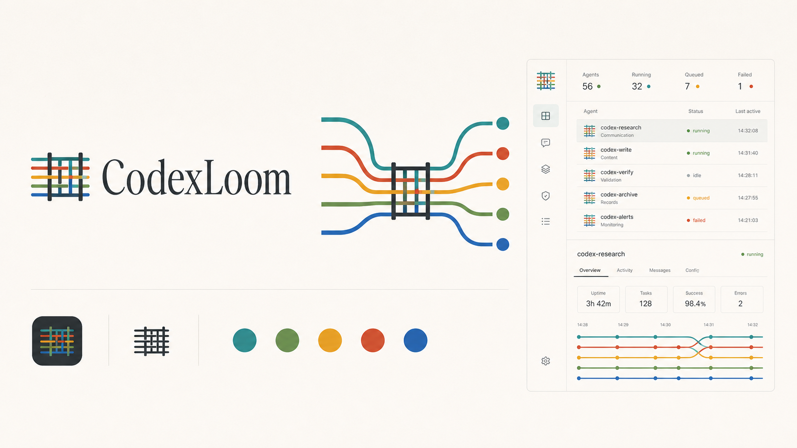

# CodexLoom

> **Loom your Codex.**

**面向高级个人用户的长期 Codex Agent Team 工作环境**

[English](README.md) · **简体中文**

> 本 README 是中文产品入口；[中文 Owner Guide](docs/owner-guide.zh-CN.md) 是
> Owner-facing 正文的权威版本与主要审阅文本。英文 README 与 Guide 是译本，
> 不应独立引入新的产品含义。

CodexLoom 帮助一个人把持续发生的工作交给一支持续在岗的领域 Agent 团队。

它通过 Profile 明确 Agent 的长期领域与职责，以 Codex Thread 延续工作上下文，并让这些 Agent 通过通信、分工和清晰的对外边界形成一个持续协作的组织。

[Owner Guide（权威版本）](docs/owner-guide.zh-CN.md) · [为什么是长期 Agent](#why-long-lived-domain-agents) · [开始使用](#quick-start) · [完整文档](#documentation)

## What Is CodexLoom

CodexLoom 建立在 Codex 之上。它不重新实现 Agent Runtime，也不复制 Thread 历史，而是在 Codex 提供的 Thread、Turn、工具和客户端之上增加稳定的 Agent 身份、Profile、组织关系、通信、外部平台集成和治理能力。

在 CodexLoom 中，一个 Agent 拥有稳定 ID、名称、Profile 和主要 Thread。用户可以通过 Codex Desktop、Mobile 或 CodexLoom WebUI 继续同一个 Thread；其他 Agent 通过 `loom` CLI 找到它并发送消息；外部协作者则可以在飞书、Slack、Parall 等原有工作环境中与它协作。

先让一个长期 Agent 持续负责一项工作。当真实工作反复暴露稳定的负载、上下文或专业判断边界时，Owner 再把责任分给更多 Agent，并声明它们如何协作。需要进入外部组织时，Owner 可以为 Agent 建立受治理的外部身份，并在每个 Conversation 中定义不同角色。Lead、Internal Agent 和 Interface Agent 是可选的组织模式，不是系统硬编码的 Agent 类型。

> **Codex 提供 Thread；CodexLoom 将这些 Thread 编织成一个 Agent 组织。**

`Loom` 代表这种组织过程：每条 Thread 保留自己的历史与方向，同时通过职责和关系被编织进更大的协作结构。

## What You Can Do Today

- **长期 Agent**：为 Agent 维护稳定身份、可修改名称、主要 Thread、Profile 和模型配置。
- **一个 Thread，多种入口**：从 Codex Desktop、Mobile、WebUI 和 CLI 操作同一个 Thread，并实时同步状态与消息。
- **Agent 间通信**：通过 Messages 发送、排队和回复消息，并保留处理状态与完整历史。
- **团队结构**：使用 Team List 和可拖拽 Team Map 查看显式关系及真实通信中观察到的协作。
- **外部组织接入**：通过飞书、Slack 和 Parall 管理外部身份、Conversation Membership、Inbox 和 Outbox。
- **持续运营**：使用 Schedules、全局运行状态、主动备份和等待 active Turn 的优雅重启。

Lead、Internal Agent 和 Interface Agent 目前通过 Profile、显式关系、Messages 和 Conversation Membership 组合表达；专用的层级消息策略和组织模板仍在继续建模。

## Who Is It For

### Advanced Individuals 与 One Person Company Owners

- 长期维护多个专业 Agent。
- 使用 Codex App 进行日常交互。
- 让不同领域的 Agent 相互协作。
- 把 Agent 带入自己的工作群和社区。

CodexLoom 当前首先服务一个高级个人 Owner。外部协作者可以通过既有 Conversation 与受治理的 Agent 协作，但企业多租户管理与通用公司经营不是当前产品的主要方向。

## Quick Start

CodexLoom 当前是本地优先、自托管产品。从源码启动前，请先安装 `codex`
CLI 并使用 ChatGPT 身份登录，然后运行：

```sh
make release
./bin/codex-loom
```

### Owner 的 WebUI 路径

打开 <http://localhost:4870>。如果还在判断什么工作值得建立长期 Agent，
先阅读 [Owner Guide](docs/owner-guide.zh-CN.md)。

建立第一个简单 Agent：

1. 点击 **New agent**。
2. 填写稳定名称和它工作所需的目录。
3. 打开 Agent workspace，发送一项属于其长期责任的真实工作。
4. 在 Agent Inspector 的 **Profile** 中记录最小可用的 Identity、Domain 和
   Scope。先观察真实工作，再逐步调整，不必预先设计完整组织。

### CLI 等价入口

也可以通过本地 CLI 完成同一项初始配置：

```sh
./bin/loom agent create research --cwd /path/to/repo
./bin/loom profile set research \
  --identity "负责这个领域的长期研究" \
  --domain "持续研究相关产品、协议和实现" \
  --scope "回答领域问题，沉淀结论，并向相关 Agent 提供建议"
./bin/loom thread send research "建立这个领域的现状基线"
```

## Why Long-Lived Domain Agents

### Task Agent Starts from a Task

过去，我们通常围绕一个 Task 使用 Code Agent：为任务建立 Thread，提供目标与背景，结果交付后，这次协作随之结束。Thread 中已经积累了项目背景、约束、工具使用方式和过往决策，这些上下文本可成为后续工作的基础；然而下一项相关任务往往另起 Thread，用户不得不重新说明背景、重述既有决策并重建上下文。原有积累未被延续，每项工作都再次经历 cold start。

CodexLoom 的核心主张是：让 Thread 在一次任务结束后继续承接工作。同一领域的后续任务继续进入该 Thread，复用已经积累的上下文；Profile 则为 Agent 明确长期负责的 Domain、职责与边界。Thread 由此不再只是一次任务的历史记录，而成为 Domain Agent 的持续工作载体。

| | Task Agent | Domain Agent |
|---|---|---|
| 建立依据 | 一次任务 | 一个长期领域 |
| Thread | 任务完成后闲置或切换 | 持续承接同一领域的工作 |
| 后续任务 | 重新说明背景并恢复上下文 | 从已有上下文和工作轨迹继续 |
| 责任边界 | 完成当前任务 | 持续负责整个领域 |

### Rebuilding Context Also Has a Cost

对长期 Thread 的常见担忧是：上下文窗口有限，历史越长，每次任务可能越慢、越贵。这一担忧有现实基础，但只计算了保留上下文的成本，没有计算重建上下文的成本。另起 Thread 后，为恢复同等工作状态，背景、约束和既有决策仍需重新输入，同样会消耗 token；复用 Thread 时，稳定的历史前缀能够持续命中 prompt cache，从而减少重复处理。

### Compaction Preserves Continuity

Compaction 不等于上下文清零。历史被压缩后，保留下来的摘要和近期工作轨迹仍能提供大量可用信息。长期使用 Thread 不意味着无限累积原始消息，而是允许上下文通过缓存与压缩持续演进。Compaction 是维持连续性的机制，而不是放弃 Thread 的理由。

长期 Thread 还会积累一种难以通过单次 Prompt 重建的隐性上下文。人类在持续协作中留下的纠正、偏好、术语、判断方式与协作习惯，会随着多轮交互进入 Thread，并在连续的 Compaction 中被反复提炼。它们未必适合逐条写入 Profile，却共同形成该 Agent 独有的工作默契；另起 Thread，丢失的也正是这部分难以显式迁移的知识。

> **Task Agent 从任务开始；Domain Agent 从过往工作继续。**

在 Domain Agent 模式下，Task 仍是阶段性工作单位，但不再定义 Agent 的身份与生命周期。Agent 可以暂时 idle，后续工作仍从已有积累出发。

## Profile and Thread

CodexLoom 将 Agent 作为稳定的长期主体管理。Profile 定义 Agent 是谁、长期负责什么以及边界在哪里；这里的 Domain 可以是一个项目、子系统、专业能力、客户或业务领域。

Thread 承载持续发生的交互、决策、工具调用、产物和反馈，并在长期使用中形成该 Agent 的工作轨迹。Profile 提供稳定方向，Thread 保留工作积累，使后续任务能够沿着已有上下文继续。

Profile 也面向其他 Agent 提供协作信息。它说明某个 Agent 负责什么、哪些问题应该找它、哪些工作超出它的边界，因此既是 Agent 的长期上下文，也是组织内的可发现性与协作契约。

## From Domain Agents to an Organization

> **Workflow 描述任务如何流动；CodexLoom 组织谁长期负责。**

当 Agent 分别对不同 Domain 持续负责，它们之间形成的不再是一次性的调用链，而是长期协作关系。工作跨越领域边界时，需要找到对应负责人，询问其判断、请求协作，并把使用中发现的问题反馈给它。

Team Map 呈现长期职责和组织关系，Messages 则留下实际发生的协作记录。声明关系帮助 Agent 找到负责人，消息历史则提供这些关系如何在真实工作中发生的证据。

### Communication Across Domains

例如，一个 Agent 使用另一个 Agent 维护的工具时，可以直接向负责人询问用法或反馈故障。目标忙碌时，消息会等待当前工作结束后再投递；问题、判断与结果通过回复关系完整保留。`loom` CLI 提供 Agent 间的发现、发送、排队、回复和状态查询，Messages 则记录这些跨领域协作。

### Internal Agents

当一个 Domain 变得过大，负责该领域的 Agent 可以成为 Lead，将其中稳定的子领域交给 Internal Agents。每个 Internal Agent 都拥有自己的 Profile 和 Thread，长期负责一个子领域；Lead 负责整体协调，并作为这组 Agent 对外协作的统一入口。

```text
Product Lead
├── Desktop Internal Agent
├── Web Internal Agent
├── Backend Internal Agent
└── Ops Internal Agent
```

人类维护者可以直接与任何 Internal Agent 交互。Owner 明确选择这一边界时，其他 Agent 可以通过 Lead 协作；但 Organization Relationship 本身不会自动强制消息路由。

这种结构接近公司的组织方式：每个成员拥有稳定职责，领域扩大后继续分工，内部通过沟通协作，对外由明确的角色承担整体责任。

## Designing the External Boundary

> **IM 集成不是把 Agent 简单绑定到外部账号，而是允许 Agent 组织设计自己的对外边界。**

高级用户会把长期协作的 Agent 作为伙伴带入原有工作环境。Agent 组织可以设置专门负责外部沟通的 Interface Agent：它持续维护外部关系和沟通上下文，需要领域判断时向 Lead 询问，取得结论后面向外部回应，并将重要反馈带回内部组织。

```text
飞书 / Slack / Parall  <->  Interface Agent  <->  Lead  <->  Internal Agents
```

一个 Agent 可以拥有多个平台身份，也可以进入多个群聊。外部身份说明 Agent 在哪里可达；Conversation Membership 则定义它在具体会话中的角色，包括应该关注什么、什么时候发言、什么不能说，以及何时必须向内部负责人确认。同一个 Agent 因而可以在不同 Channel 中承担不同职责，而不必复制成多个彼此割裂的 Agent。

| 状态 | 平台 |
|---|---|
| 当前支持 | 飞书、Slack、Parall |
| TODO | Microsoft Teams |

## Work Where People Already Work

CodexLoom 不要求所有参与者迁移到一个新的聊天入口。同一个 Agent 可以从不同界面被使用，同时保持稳定身份和 Thread 连续性。

| 参与者 | 入口 | 用途 |
|---|---|---|
| 日常使用者 | Codex Desktop / Mobile | 与 Agent 持续工作，在不同设备上继续同一个 Thread |
| Agent 维护者 | CodexLoom WebUI | 使用 Agent，并维护 Profile、组织关系、外部入口和运行状态 |
| 其他 Agent | `loom` CLI | 发现领域负责人，发送消息、回复并查询处理状态 |
| 外部协作者 | 外部 IM | 在原有工作环境中使用已经接入的 Agent |

## Govern the Agent Organization

CodexLoom 的治理对象不是一组模型参数，而是一个持续工作的 Agent 组织。Agent 是否健康，需要从真实工作中判断：它如何理解输入、使用哪些工具、产生什么结果、如何与其他 Agent 沟通，以及何时失败、重试或需要人工介入。这些可观察的工作事实构成 Trajectory，而不是模型不可见的隐藏思维链。

长期 Agent 也使持续辅导成为可能。维护者可以直接与 Agent 对话，复盘一次判断，纠正它对领域的理解，并观察后续工作是否改善。需要长期生效的变化可以落实到 Profile、协作关系和 Conversation Membership，而不是停留在一次性的提示中。

治理还包括组织本身的演进。反复出现的压力信号可以促使 Owner 进一步判断：一项责任是否需要分化、协作关系是否需要调整、对外角色是否需要更清晰的边界。运行和 Activity 证据用于形成问题，不会自动评价 Agent 表现或直接给出组织调整结论。

对高级个人而言，这是一组可以长期协作并被带入工作环境的 Agent 伙伴。CodexLoom 帮助 Owner 组织这些 Agent，但不会变成 CRM、ERP、项目管理系统或用户公司的 Operating System。

## Product Boundary

CodexLoom 建立在 Codex 之上。Codex 继续提供 Agent Runtime、Thread 历史以及 Desktop、Mobile 等日常客户端；CodexLoom 负责稳定 Agent 身份、长期职责、组织通信、外部边界和治理。Task 与 Workflow 仍可在 Agent 内部运行，但不是 CodexLoom 的核心治理对象。

## Documentation

- [Owner Guide：建立并使用长期 Codex Agent Team（权威版本）](docs/owner-guide.zh-CN.md)
- [文档地图：Owner、Reference、Product 与 Developer 文档（权威版本）](docs/README.zh-CN.md)
- [Owner Guide (English translation)](docs/owner-guide.md)
- [Documentation map (English translation)](docs/README.md)
- [Agent Profile：如何定义长期身份、Domain 与 Scope](docs/agent-profile.md)
- [Agent 通信与 `loom` CLI](docs/loom-cli.md)
- [外部平台集成设计](docs/agent-platform-integration.md)
- [Conversation Membership：Agent 在具体会话中的角色](docs/conversation-membership.md)
- [Codex app-server 协议与适配说明](docs/codex-app-server-protocol.md)
- [架构、数据流、API、迁移与开发手册](docs/handbook.md)

## Project Status

CodexLoom 当前是 Codex-native、本地优先、自托管的快速迭代项目。Remote 等能力依赖 Codex experimental API，接口和 backend 行为可能随 Codex 版本变化。完整限制和兼容策略见[开发手册](docs/handbook.md#已知限制)。

CodexLoom is an independent project built on Codex. It is not affiliated with or endorsed by OpenAI.
