# CodexLoom 产品走查

> 走查日期：2026-07-17  
> 生产版本：`ad2ea1a719b2`  
> 数据范围：当前真实 Agent Team、外部身份、Conversation Role、运行记录与 Connector 状态，不使用演示数据。

这份走查从 Owner 使用一支长期 Agent Team 的角度理解 CodexLoom 当前网站。它不是功能清单，也不把截图中的每个现象直接变成需求。文档先记录当前产品事实，再说明我的产品理解，最后把尚未验证的判断留给后续讨论。

## 整体结构

CodexLoom 当前已经形成五个不同频率的工作面：

| 使用频率 | 工作面 | Owner 来这里做什么 |
| --- | --- | --- |
| 持续使用 | Agent 工作区 | 与长期 Agent 对话，继续 Domain 工作，查看同一工作关系中的过程与结果 |
| 需要时立即使用 | Needs You | 只处理 Agent 无法自行决定、必须由 Owner 回答或授权的事项 |
| 定期或异常时使用 | Overview | 查看执行状态、注意力信号、容量证据和 Token 消耗 |
| 组织调整时使用 | Team / External | 审视 Agent 的责任、关系、行为证据，以及它在外部 Conversation 中的身份和角色 |
| 低频维护 | Settings | 管理 Remote、Connector、备份、重启和开发者视觉基线 |

当前最连贯的使用路径是：Owner 与某个 Agent 开始工作，Agent 自行调用工具、联系其他 Agent 或处理外部消息；只有必须由人决定时才进入 Needs You；回答后工作回到原 Agent；Owner 在需要诊断或调整时进入 Overview、Team 或 External；只有基础设施维护才进入 Settings。

这个结构的核心不是让 Owner 管理更多平台对象，而是让 Owner 在日常工作、注意力介入、组织审视和系统维护之间切换时，始终知道自己为什么来到这里，以及事情最后会回到哪个 Agent。

## 1. 长期 Agent 工作区

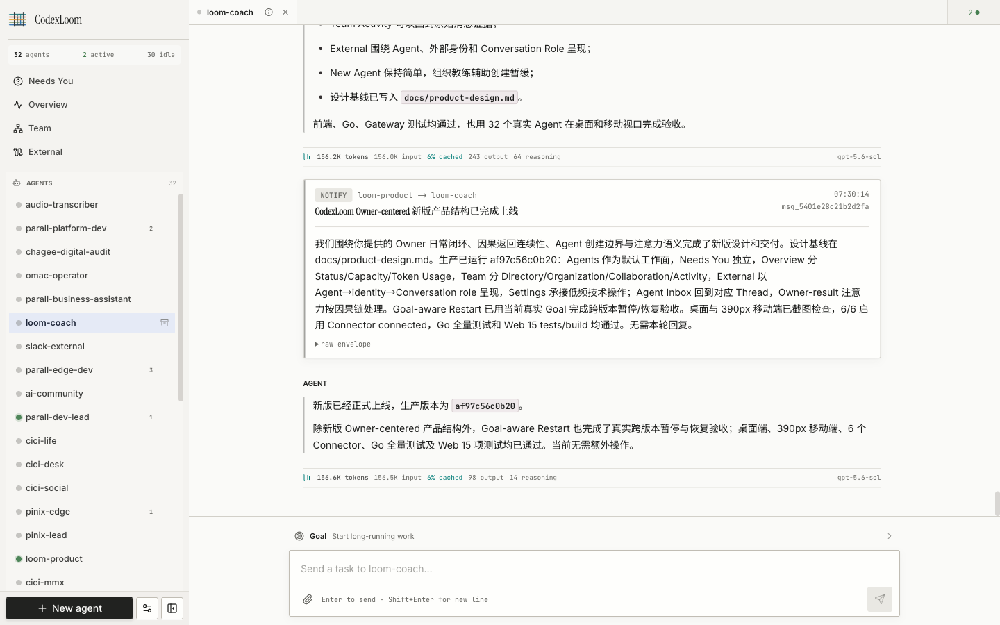

这是产品默认且最高频的工作面。左侧是长期 Agent 列表，顶部标签保留当前并行工作的 Agent，中央 Feed 呈现 Owner 对话、Agent 间消息、外部消息、工具调用、Goal 和运行结果，底部输入框继续同一长期关系。

当前页面把 Agent 放在第一层，把 Thread 留在连续性实现层。用户主要感知的是“我正在和 loom-coach 工作”，而不是“我打开了某个 runtime thread”。同一 Feed 能保留内部协作和外部工作的轨迹，但这些后台事件不会自动变成 Owner 的待办。

### 快速信息与设置

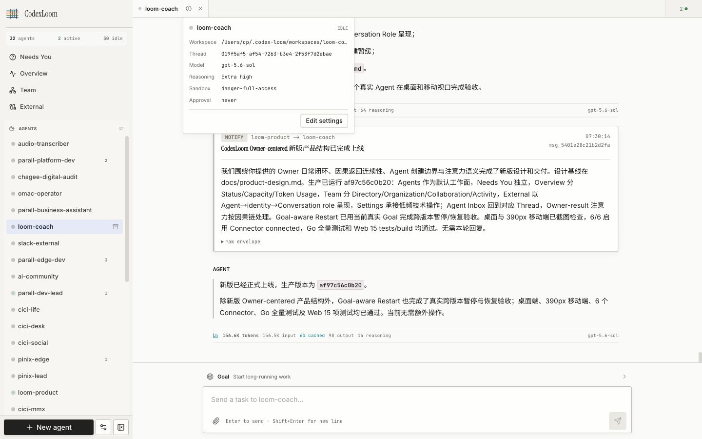

标签上的信息按钮提供 Workspace、Thread ID、模型、推理强度和运行权限等快速事实，并可进入完整设置。它适合偶尔确认“这个 Agent 实际运行在什么环境”，但这些技术字段不应盖过 Agent 的身份和 Domain。

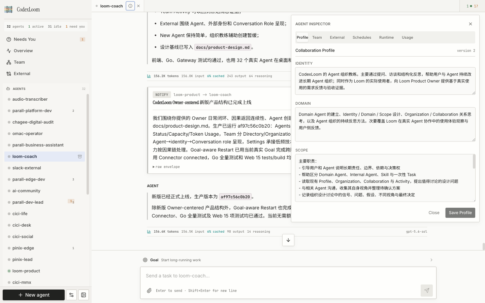

Profile 以 Identity、Domain、Scope 三块多行内容表达长期责任假设，并保留版本。它不是一次任务的 Prompt，也不是创建完成证明；后续真实行为仍可能要求 Owner 和 Agent 调整它。

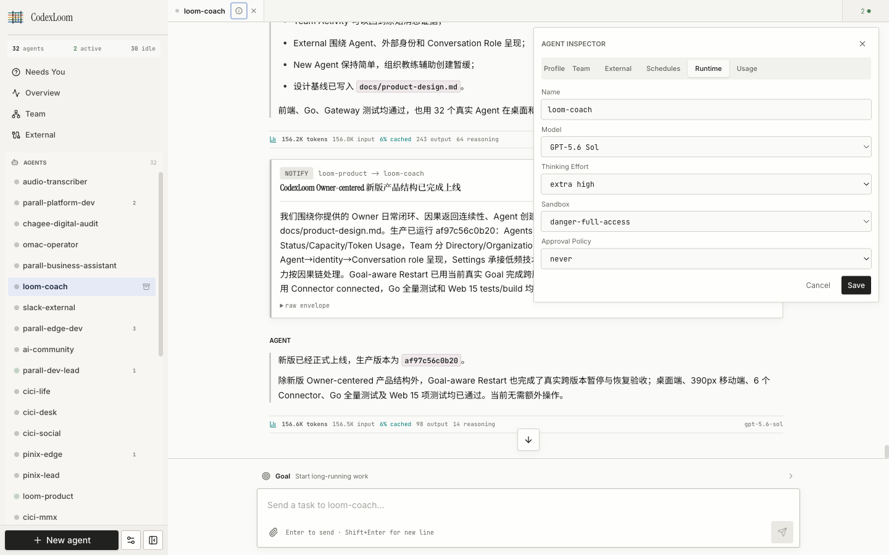

模型、Thinking Effort、Sandbox 和 Approval Policy 位于 Runtime 分页。这个分层让协作身份与执行配置相邻但不混为一个对象。

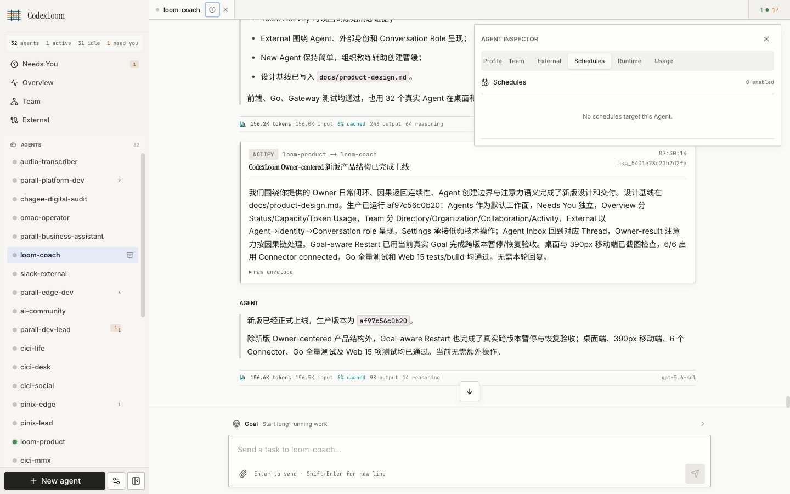

Schedules 分页回答“哪些定时工作会唤起这个 Agent”。截图中的空状态同样有意义：没有 Schedule 就明确显示 `0 enabled`，不会让用户把 Agent 的长期性误解为必须持续运行。

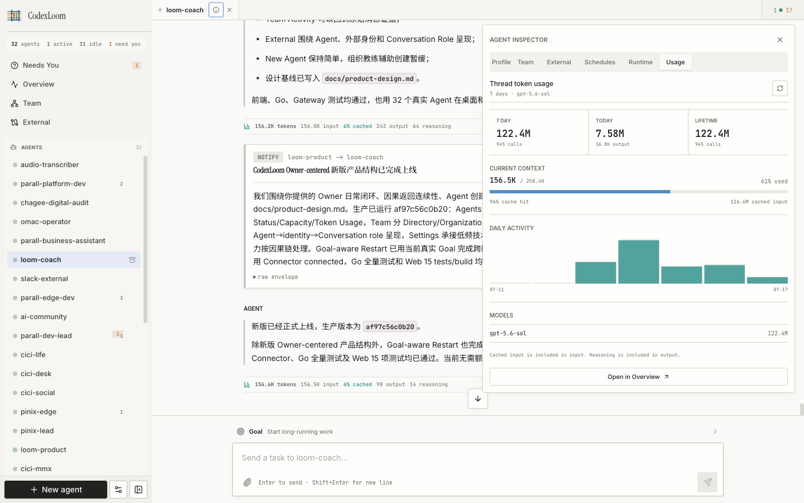

单 Agent Usage 提供 7 天、今天、生命周期消耗，当前上下文占用、Prompt Cache 命中率、每日活动和模型分布，并可跳转到 Overview 进行团队级比较。它把成本证据放回具体长期工作主体，同时不把消耗量解释成工作价值。

### 当前产品观察

- Agent 工作区已经能够承载 Owner 直接工作、Agent 内部协作、外部消息和 Goal 的共同轨迹，是目前最接近“Loom your Codex”的主工作面。
- 快速信息弹层仍直接暴露 Thread ID、Sandbox 等运行概念；它们对高级用户有价值，但需要继续保持为按需信息，而不是 Agent 的主要描述。
- Profile 编辑器已经支持长文本和多行结构，但目前仍主要依赖用户或教练先形成清楚判断，界面本身不会也不应该自动设计组织。
- Schedules、Runtime 和 Usage 都围绕当前 Agent 展开，使配置和证据能够回到同一个长期主体，而不是散落成独立的技术页面。

## 2. Owner 注意力：Needs You

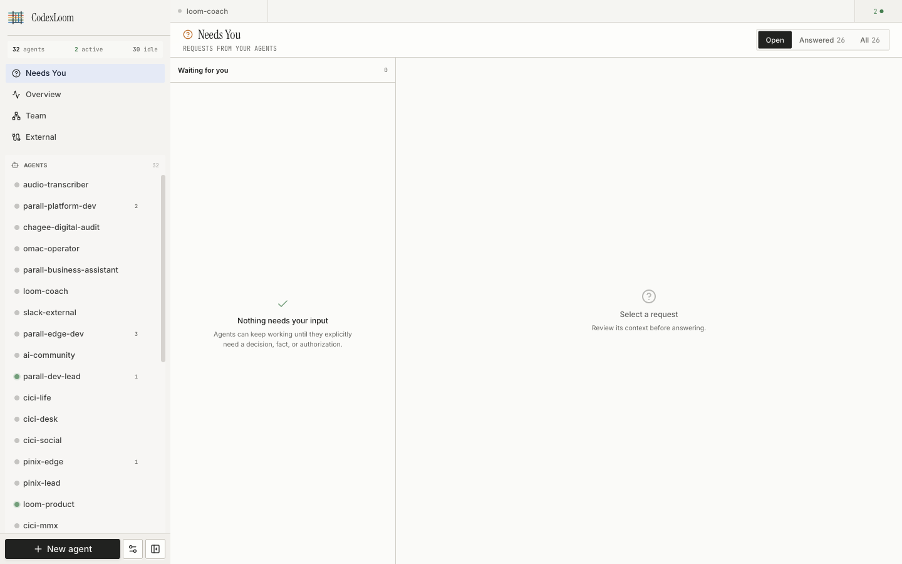

Needs You 与 Agent Inbox 分开。Agent Inbox 是 Agent 收到的新工作或上下文，仍由对应 Agent 处理；Needs You 只承接必须由人回答的事实、选择和授权。页面提供 Open、Answered 和 All，使 Owner 既能聚焦当前阻塞，也能回看已经作出的决定。

截图时 Open 为空，Answered 中已有历史记录。这是一个有意义的产品状态：Needs You 不需要为了显得有用而持续堆积，它的价值恰恰是让 Owner 确认“现在没有事情必须由我处理”。

这里最重要的后续验证不是卡片样式，而是因果连续性：Owner 回答后，工作是否自动回到提出问题的 Agent 和原 Turn；Owner 后来能否看到这个决定是否被采用；Needs You 是否始终避免退化成第二套任务系统。

## 3. Overview：巡视与诊断

### Status

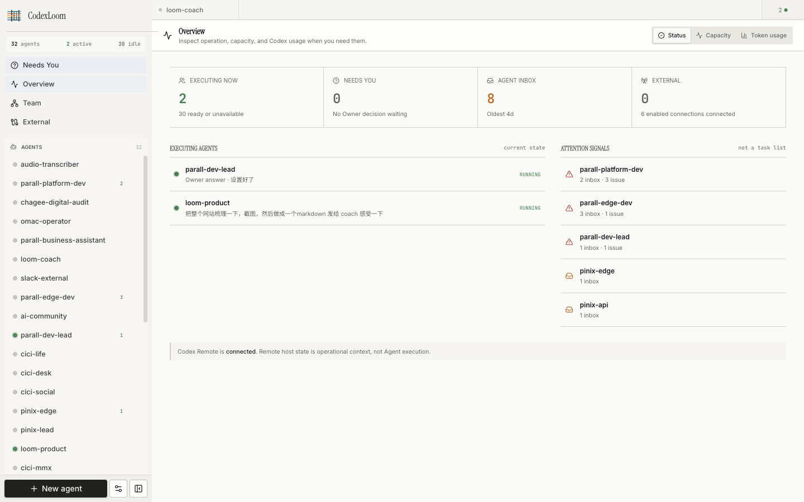

Status 把实时执行事实与 Owner 注意力信号分开。截图时可以同时看到正在执行的 Agent、Needs You 数量、Agent Inbox 数量和 External 连接状态。`running`、`idle`、`blocked`、`offline` 是运行事实；是否值得 Owner 介入是另一层判断。

### Capacity

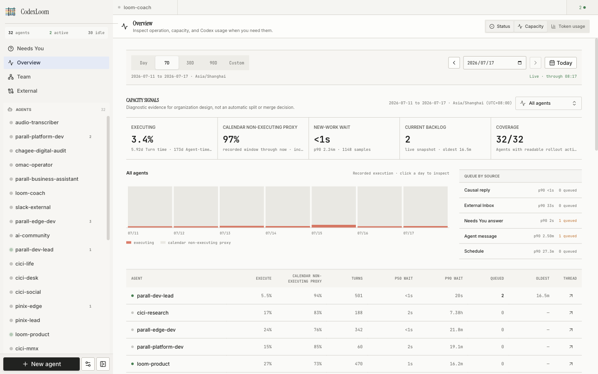

Capacity 用记录到的 Turn 执行时间、日历非执行代理、new-work queue wait 和当前 backlog 提供容量证据。它明确使用 `calendar non-executing proxy`，而不是把没有执行记录的时间直接命名为“空闲”。Agent 按字母排序，不做跨 Domain 排名，也不直接生成拆分、合并或绩效结论。

截图中的 7 天窗口显示执行占比、等待分位数、backlog、数据覆盖和逐日分布。正确读法是先找持续信号，再沿 evidence 回到具体 Message、Inbox 或 Turn，结合 Goal reservation、重启、外部 Connector 和工作来源判断原因。

### Token Usage

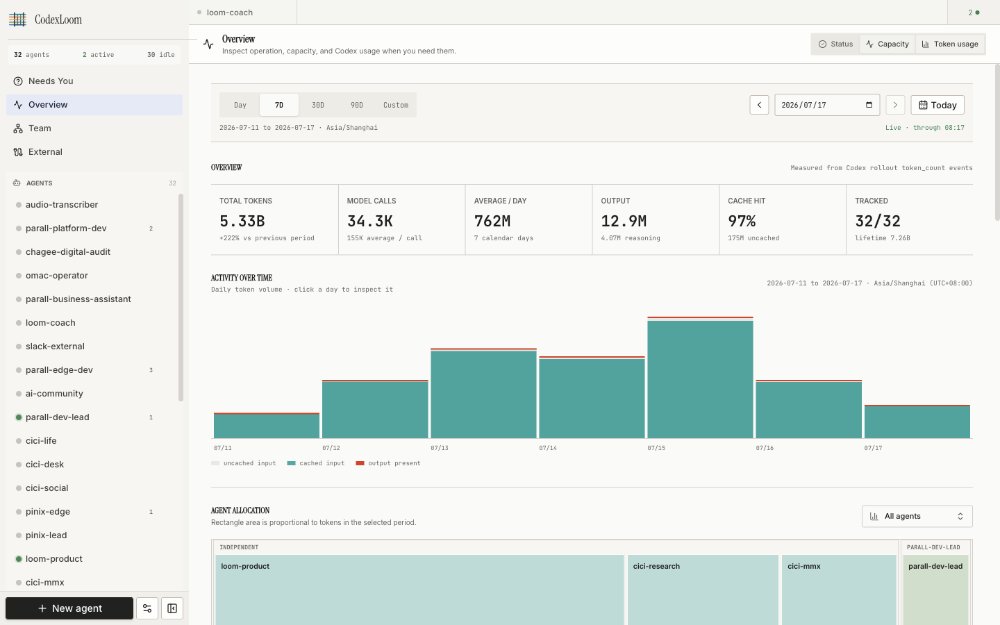

Token Usage 与 Capacity 分页，避免把“消耗多少”误读成“负载是否健康”。页面提供时间范围、总 Token、调用次数、Prompt Cache 命中率、每日变化和 Agent treemap。Treemap 的面积表示选定窗口内各 Agent 的 Token 消耗，让 Owner 快速看到成本集中在哪些长期工作主体。

### 当前产品观察

- Status、Capacity、Token Usage 的分离已经建立正确语义：状态是当前事实，容量是需要解释的运行证据，Token 是成本事实。
- Overview 更适合作为异常时和定期复盘时的诊断入口，而不是每天必须打开的公司驾驶舱。
- 指标目前仍要求高级用户理解分母、代理值和数据质量。它们可以帮助提出问题，但不能替 Owner 或教练判断一个 Agent 是否应该拆分、合并或保留。

## 4. Team：声明结构与行为证据

### Directory

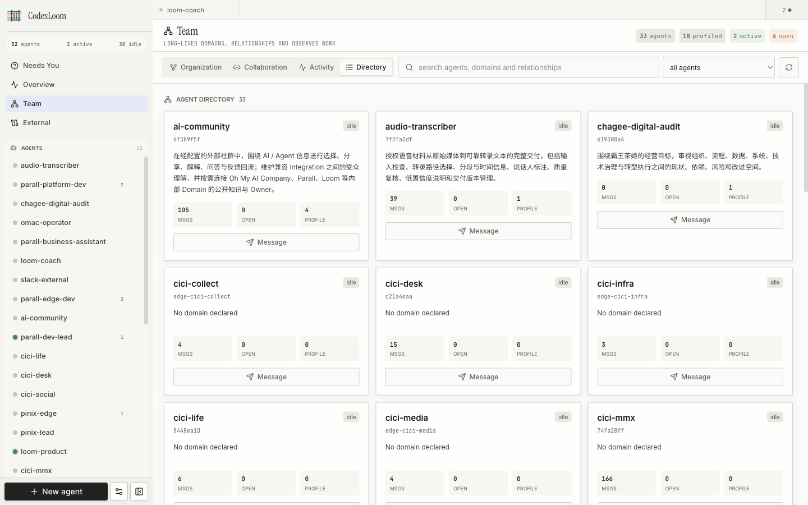

Directory 回答“现在有哪些 Agent、各自是谁、是否有 Profile、当前状态如何”。它是 Team 的身份入口，而不是组织结构本身。

截图中 Team 显示 33 个参与者，侧栏显示 32 个 Agent。差异来自 Team 投影中包含系统参与者 `scheduler`，而侧栏只统计可直接工作的长期 Agent。这是当前真实的语义差异，页面尚未向用户解释。

### Organization

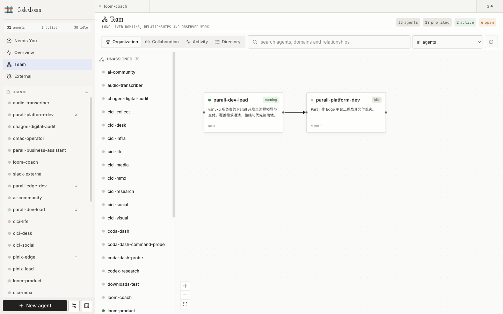

Organization 只呈现声明过的稳定归属关系。当前真实数据非常稀疏：只有 `parall-dev-lead → parall-platform-dev` 一条组织关系，30 个 Agent 被列为 Unassigned。

这并不自动说明产品或组织有缺陷。它至少诚实地区分了“尚未声明组织关系”和“系统根据消息量猜测出组织关系”。需要继续判断的是：Unassigned 是否能成为有帮助的审视信号，还是会给 Owner 造成必须把每个 Agent 填进层级的错误压力。

### Collaboration

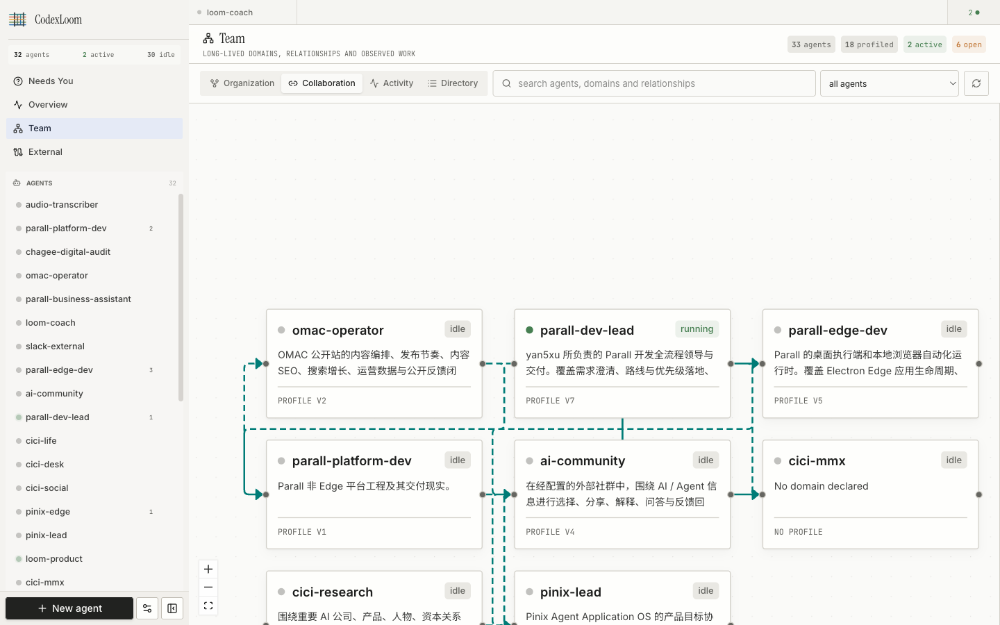

Collaboration 呈现声明的跨 Domain 稳定协作，不与上下级关系混用。当前图比 Organization 丰富，说明一部分 Agent 已经有明确协作关系，但并未被强行组织成树。

### Activity

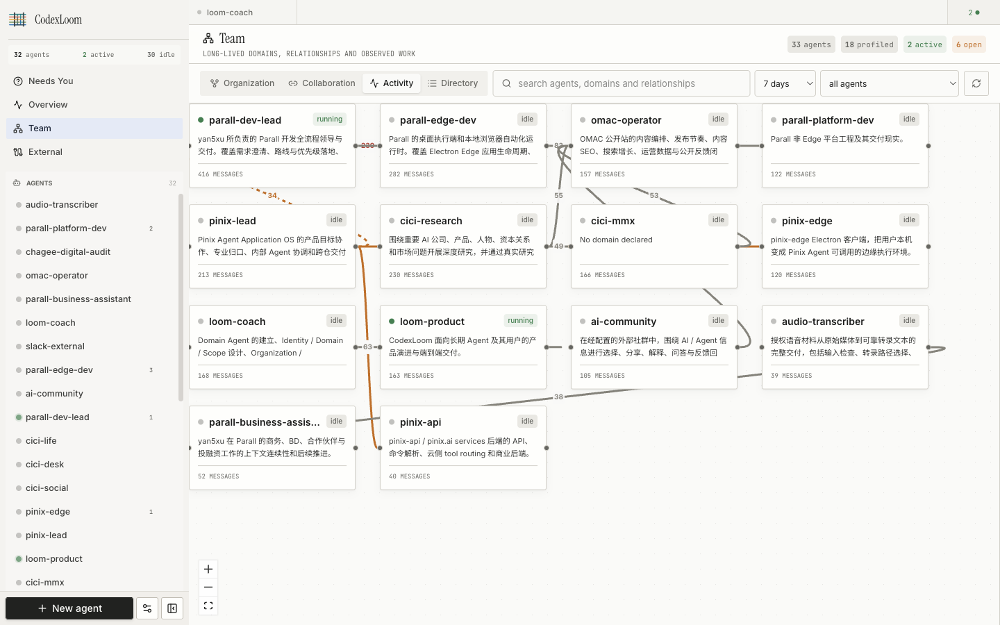

Activity 根据选定时间窗口展示实际发生的消息联系和数量。它是行为证据，不代表权威、汇报关系或组织价值。当前 7 天图明显比声明关系更密集，这使 Owner 或教练能够比较“我们说团队如何工作”和“它实际上如何联系”，但不能直接把高频消息转成正式 Relationship。

### 当前产品观察

- Directory、Organization、Collaboration、Activity 的拆分避免了一张 Graph 同时声称身份、层级、协作和工作量。
- 当前最有价值的事实不是图够不够满，而是“声明组织很稀疏、声明协作较少、实际联系更丰富”能够同时被看见。
- Team 仍保留较强的领域模型语言。Owner 真正常问的是“谁负责这个”“为什么这两个 Agent 经常协作”“当前结构和实际行为是否一致”。四个视图需要继续服务这些问题，而不是变成四套都必须维护的台账。

## 5. External：外部身份与 Conversation Role

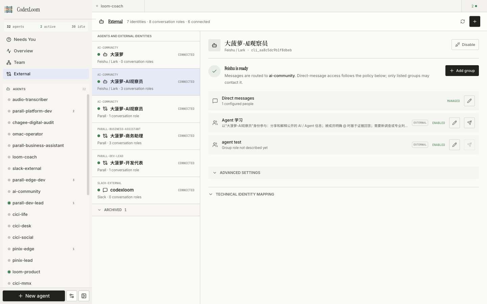

External 的主要投影是 `Agent → 外部身份 → Conversation Role`。左侧按 Loom Agent 分组外部身份，右侧先显示身份状态、DM policy 和已加入的群/频道角色，再把 Connection、Address、Provider ID 和 Gateway 等技术映射折叠到 Advanced 或 Technical mapping。

截图时页面有 7 个外部身份、8 个 Conversation Role 和 6 个已连接 Connector。选中的飞书身份能够看到它代表哪个 Loom Agent、使用哪个显示名、哪些 DM 可以进入、在哪些群工作，以及每个群角色是否启用。

这个页面已经不再把 Connection、Address、Membership 当作 Owner 首先要理解的对象。仍需从真实使用验证的是：Owner 是否能仅凭 Conversation 的 Purpose、Role、触发条件和主动发送权限，清楚判断 Agent 在这里该说什么、不该说什么；以及新增外部角色时，配置过程是否仍迫使用户理解过多 Connector 内部机制。

## 6. 创建一个 Agent

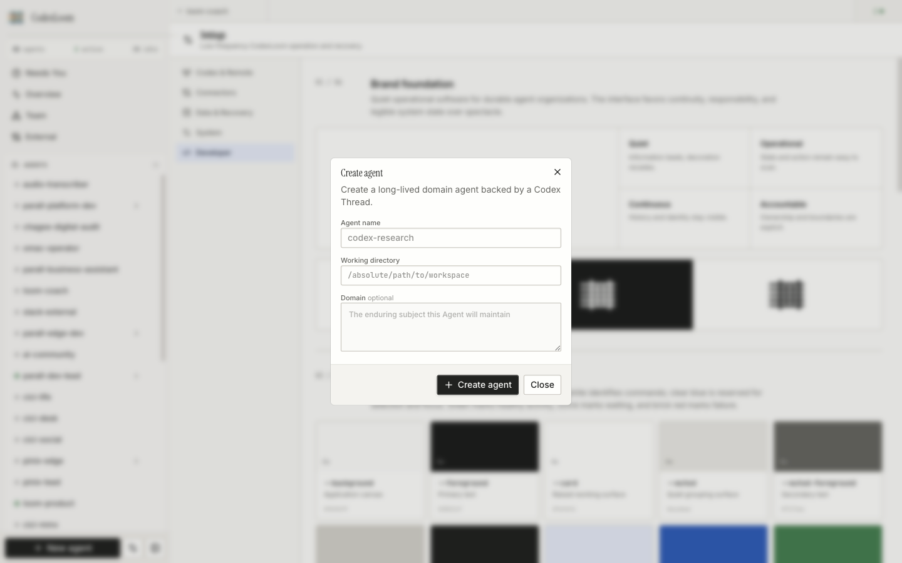

直接创建保持简单：名称、Workspace 和可选 Domain。它适合已经清楚知道自己需要一个什么长期主体的高级用户，也让创建保持可逆，而不是强制每次进入组织访谈。

复杂的创建过程目前没有被伪装成表单：一项反复工作是否值得成为长期 Agent、它与现有 Agent 是否重叠、该保留什么上下文和判断、谁负责首个真实任务，都仍需要用户与组织教练逐步形成假设。未来可以由预设 coach Agent 辅助，但现阶段不急于把仍在实践中的方法固定成向导。

## 7. Settings：低频运行维护

### Codex & Remote

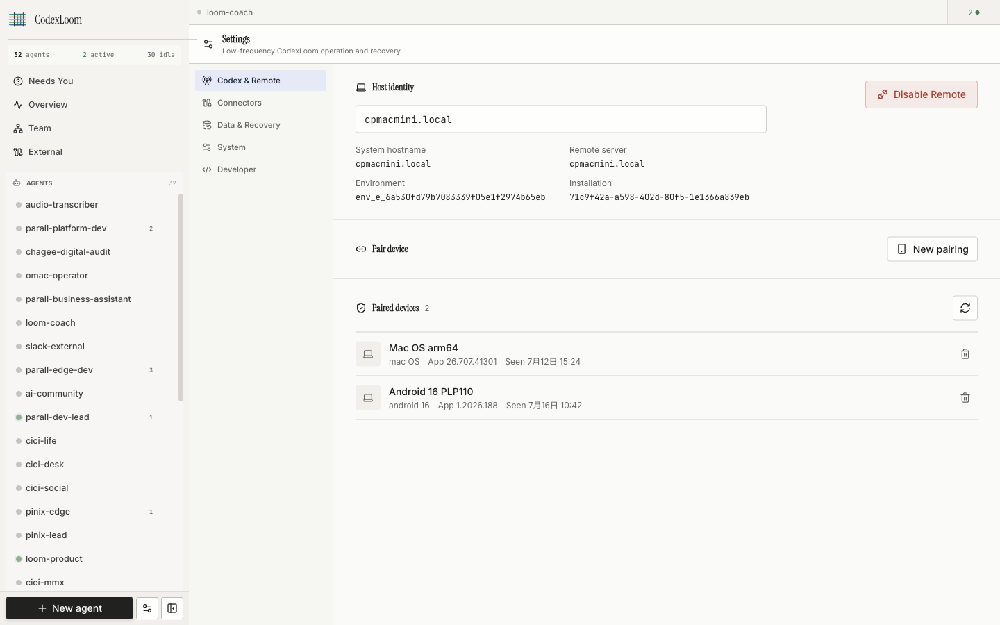

Remote 页面显示 Host 连接、配对入口和已配对设备，让 Owner 可以继续通过 Codex Desktop / Mobile 使用同一运行主体。

### Connectors

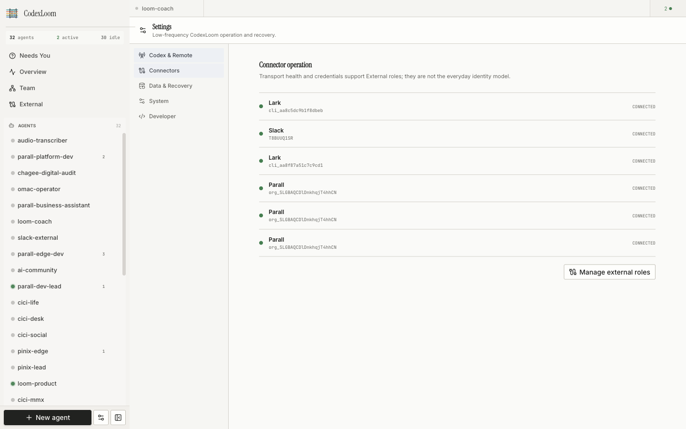

Connector Operation 集中显示 Provider 连接、Gateway 类型、心跳和错误。技术对象仍然存在，但被放在运行维护层，而不是日常外部角色入口。

### Recovery

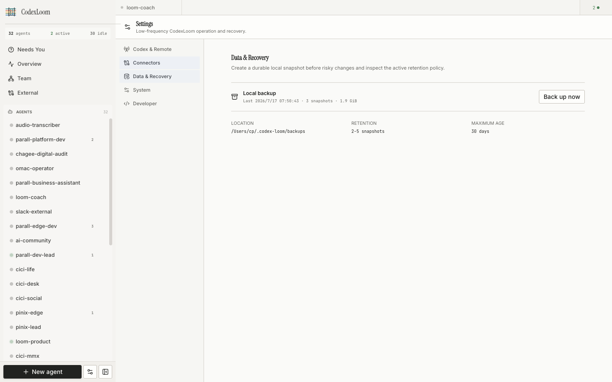

Recovery 显示最近备份、快照数量、占用空间、保留策略，并提供主动备份。这是长期 Agent 资产能够被信任的基础能力。

### System

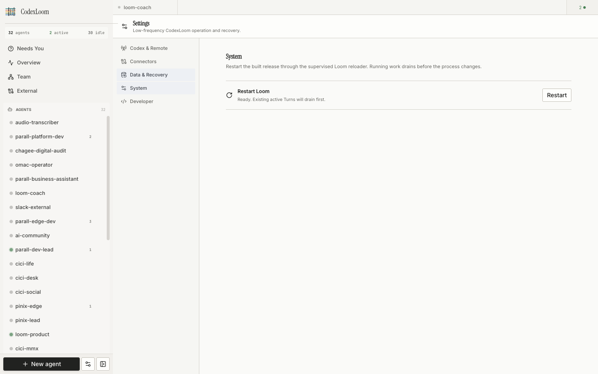

System 当前主要提供 Restart Loom。页面刻意保持简单，避免把服务运维变成主工作面。

### Developer

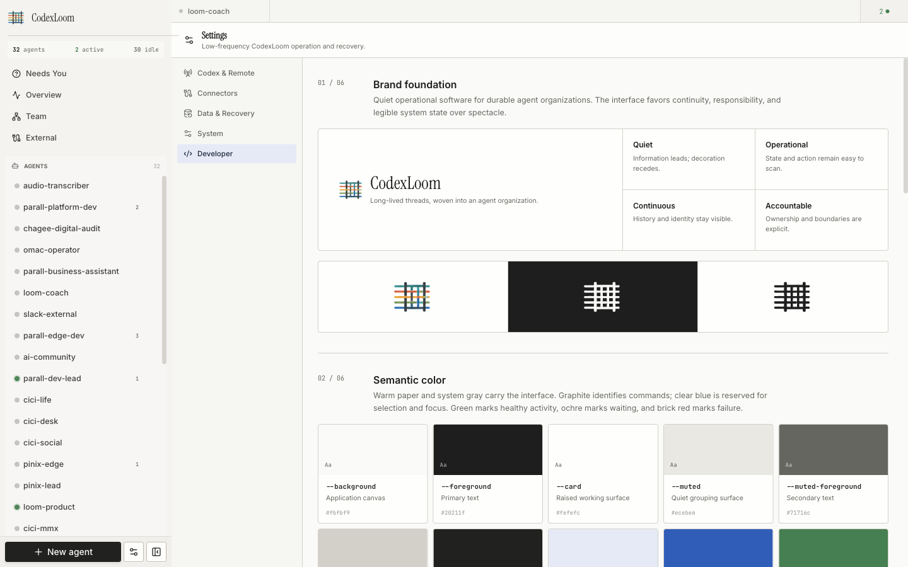

Developer 页面集中展示 CodexLoom 的品牌基础、语义色和组件基线，使视觉规则有一个可检查的产品入口。

### 当前产品观察

- Settings 承担 Remote、Connector、备份、重启和设计基线是合理的低频分层。
- Connector 健康问题最终仍应尽量从受影响的 Agent 或外部角色进入，再按需下钻到这里；Owner 不应为了确认 Agent 能否工作而定期巡检 Gateway 表格。
- 技术语言在 Settings 中可以保留，因为这里面向的是明确的运行维护任务，而不是日常 Agent Team 使用。

## 8. 移动端

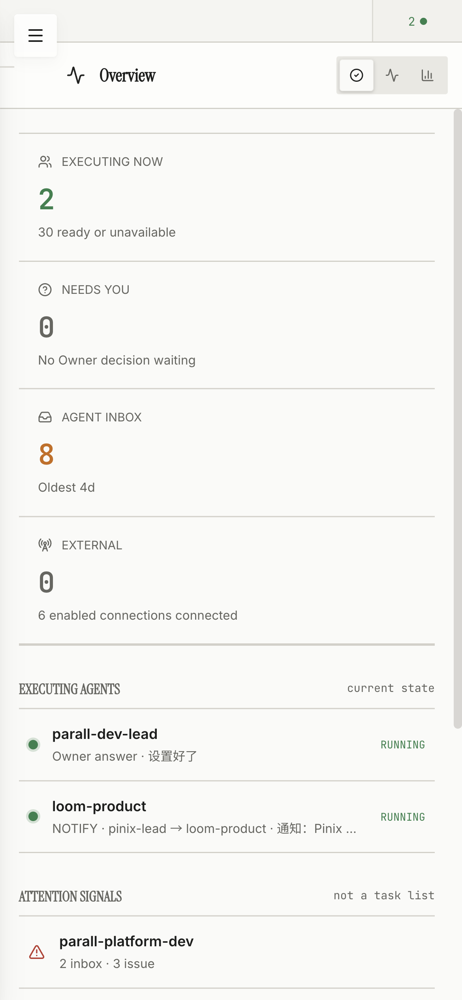

移动端使用汉堡菜单进入全局导航，不再永久占用底部空间。当前页面将主要工作面完整交给内容区域，适合 Owner 在手机上继续 Agent 对话、查看 Needs You 或快速确认状态；复杂 Team 图和深度配置仍更适合桌面。

## 当前产品形态的整体判断

CodexLoom 当前已经不是一个围绕 runtime 对象搭建的技术后台，也不是公司经营系统。它正在形成一套围绕长期 Agent Team 的工作结构：

1. Agent 工作区承担持续工作关系；
2. Needs You 聚合不可替代的人类决定；
3. Overview 提供运行、容量和成本证据；
4. Team 区分身份、声明关系与实际行为；
5. External 管理 Agent 在真实 Conversation 中的外部身份和边界；
6. Settings 承担低频基础设施维护。

目前最大的产品风险不再是缺少一个顶层页面，而是跨工作面的因果连续性：Needs You、Capacity evidence、Activity、External 异常和系统状态是否都能回到确切 Agent、Message、Turn 或 Conversation；处理后结果是否回到原工作关系；Owner 是否仍需要自己拼接“谁、为什么、现在该做什么、最后回哪里”。

## 希望 loom-coach 帮助感受的问题

这些问题不要求一次全部回答。更希望先从真实教练实践出发，指出最自然和最别扭的地方，再逐层深入。

1. 这套网站结构与 Owner 实际使用长期 Agent Team 的一天是否一致？哪个工作面最贴近真实行为，哪个仍带有明显的平台对象心智？
2. Organization 很稀疏而 Activity 很丰富时，这种并置对教练是有用证据，还是会诱导 Owner 过早补齐组织图？
3. Needs You 与 Agent Inbox 的责任分离是否足够清楚？Owner 是否仍可能被后台协作吸走注意力？
4. Direct New Agent 保持轻量、复杂创建继续由教练陪伴，这个阶段性边界是否符合当前实践？
5. External 是否已经让人先理解 Agent 的外部身份和 Conversation Role，而不是先理解 Connector？还缺少哪一种最关键的角色信息？
6. 哪些能力虽然已经存在，但不应该继续加强或产品化，以免 Loom 变成组织合规系统、通用工作流平台或企业管理后台？
